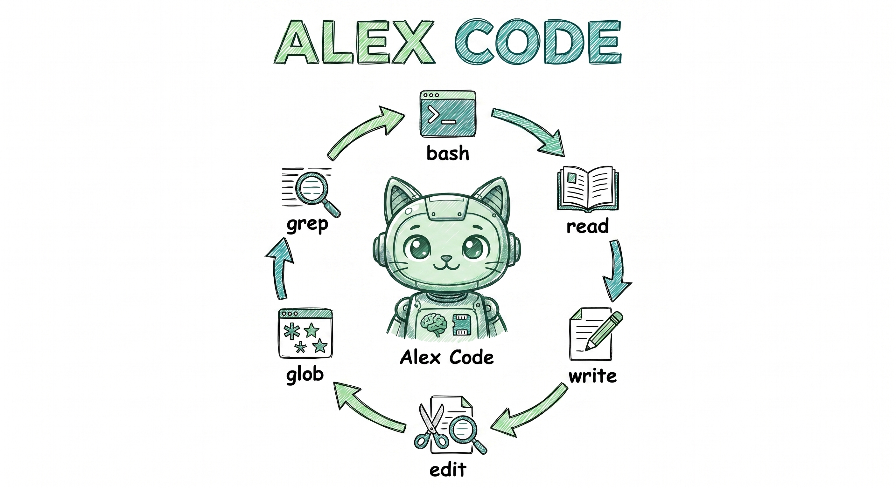

# AI Agent



A CLI-based AI coding agent with tool use, memory, MCP support, and conversation compaction.

> **Node.js + TypeScript.** This project was rewritten from Python to Node.js/TypeScript.
> It targets Node 20+, uses ES modules and strict TypeScript, and is tested with Vitest.

## Quick Start

```bash
# Install dependencies and build
npm install
npm run build

# API keys
export ANTHROPIC_API_KEY="sk-ant-..."   # main LLM + mem0 fact extraction
export OPENAI_API_KEY="sk-..."          # mem0 embedder (text-embedding-3-small)

# Run (built)
node dist/index.js

# …or run directly from source during development
npm run dev
```

## Requirements

- Node.js 20+
- An Anthropic API key (used for the agent and for mem0's memory extraction)
- An OpenAI API key (used for mem0's embedder; swap providers in `config.yaml` if you prefer another provider)

## Installation

```bash
cd /path/to/agent
npm install        # installs dependencies (mem0ai is optional and loaded lazily)
npm run build      # compiles TypeScript to dist/
npm link           # optional: exposes the `alexcode` command globally
```

The `mem0ai` vector-memory SDK is an **optional dependency**, loaded via dynamic
import. If it (or its embedder/vector backend) is unavailable, the agent runs
normally — the curated `MEMORY.md` layer still works and vector search simply
returns no results.

### Scripts

| Script | Purpose |
|--------|---------|
| `npm run dev` | Run the CLI from source via `tsx` |
| `npm run build` | Compile to `dist/` |
| `npm start` | Run the compiled CLI (`node dist/index.js`) |
| `npm test` | Run the Vitest suite |
| `npm run typecheck` | Type-check without emitting |
| `npm run lint` | ESLint |
| `npm run format` | Prettier |

## Configuration

The agent reads config from three locations (merged in order):

1. `config.default.yaml` (bundled defaults)
2. `./config.yaml` (project-level overrides)
3. `~/.config/agent/config.yaml` (user-level overrides)

Environment variables are interpolated via `${VAR_NAME}` syntax.

### Minimal `config.yaml`

```yaml
model: claude-sonnet-4-6
```

## Usage

```bash
# Run
node dist/index.js          # or: npm run dev

# Override model via CLI flag
node dist/index.js --model claude-sonnet-4-6

# Resume a previous session
node dist/index.js --resume [session-id]
```

Type your message and press **Enter** to send. Use `\` at the end of a line for multiline input.

### Commands

| Command | Description |
|---|---|
| `/help` | Show available commands |
| `/exit` | Save history and exit |
| `/clear` | Clear conversation and start a new session |
| `/history` | Show current conversation messages |
| `/tokens` | Show total token usage |
| `/tools` | List available tools |
| `/sessions` | List saved conversation sessions |
| `/resume [id]` | Resume a previous conversation session |
| `/compact` | Manually trigger conversation compaction |
| `/model [name]` | Switch LLM model (supports aliases: `opus`, `sonnet`, `haiku`) |
| `/effort [level]` | Set reasoning effort (`low`, `medium`, `high`, `xhigh`, `max`, `auto`) |
| `/prompt` | Display the current system prompt |
| `/plan` | Toggle plan mode on the main agent (read-only exploration) |
| `/skills` | List all available skills |
| `/<skill-name> [args]` | Invoke a skill (e.g., `/review-pr 123`) |

## Built-in Tools

The agent has access to these tools (called automatically by the LLM):

| Tool | Description |
|---|---|
| `bash` | Execute shell commands (configurable timeout) |
| `read` | Read file contents with line numbers |
| `write` | Create or overwrite files |
| `edit` | Find-and-replace text in files |
| `glob` | Find files by glob pattern |
| `grep` | Search file contents (uses ripgrep if available) |
| `ask_user` | Prompt the user for input during execution |
| `web_fetch` | Fetch and extract content from URLs (HTML, JSON, text) |
| `web_search` | Search the web (Brave Search API or DuckDuckGo fallback) |
| `subagent` | Delegate tasks to independent sub-agents (sync or async) |
| `plan` | Create structured implementation plans via read-only exploration |
| `memory_search` | Search the agent's mem0 memory across past sessions |
| `memory_save` | Append a curated entry to MEMORY.md (long-term knowledge) |

## Memory

The agent has two memory layers:

1. **MEMORY.md** — a single human-curated file at `~/.config/agent/MEMORY.md` (user-scoped, shared across all projects). Auto-loaded into every system prompt. Use it for stable, long-term knowledge: project conventions, user preferences, architecture decisions. The `memory_save` tool appends to it; you can also edit it directly.

2. **mem0** — automatic memory, behind a pluggable `MemoryProvider` interface. After each user→assistant turn, the full turn is batched into a single [mem0](https://mem0.ai) `add()` call on a background queue, where an LLM extracts and stores salient facts. The `memory_search` tool queries this index for recall across past sessions. The `mem0ai` SDK is loaded via dynamic import; if it's unavailable the provider degrades to a no-op (search returns nothing), and the curated MEMORY.md layer is unaffected.

### Scope

`memory.scope` in `config.yaml` selects where mem0 memories live:

| Scope | Store path | `user_id` | Use case |
|---|---|---|---|
| `global` (default) | `~/.config/agent/mem0/global/` | `"global"` | Personal CLI: your assistant remembers you across all projects. |
| `project` | `<project>/.agent/mem0/project/` | absolute project path | Team-shared repo: keep one project's conversations isolated. |

```yaml
memory:
  scope: global    # or "project"
```

### Stack defaults

- **LLM (memory extraction):** Anthropic `claude-haiku-4-5` (`${ANTHROPIC_API_KEY}`)
- **Embedder:** OpenAI `text-embedding-3-small` (`${OPENAI_API_KEY}`)
- **Vector store:** provided by the `mem0ai` OSS SDK

LLM and embedder are swappable in `config.yaml` under `mem0.llm` / `mem0.embedder`. See `config.default.yaml` for the full schema.

## Plan Mode

Two complementary mechanisms support an explore-then-implement workflow:

- **`/plan` command** — toggles plan mode on the main agent, restricting it to read-only exploration so it doesn't make changes while you're still planning. Run `/plan` again to exit.
- **`plan` tool** — delegates to a read-only sub-agent that explores the codebase and produces a markdown plan.

### How It Works

1. The LLM calls the `plan` tool with a task description (or you toggle `/plan` first to stay in read-only mode while planning)
2. The sub-agent explores using read-only tools (`read`, `glob`, `grep`, `bash`, `web_fetch`, `web_search`, `ask_user`)
3. It writes a markdown plan to `.agent/plans/<session_id>.md`
4. The tool's output is part of the conversation history, so the agent follows the plan from history on subsequent turns. Resuming the session via `/resume` reloads that history.

Plans are free-form markdown — no fixed template. Each session has its own plan file at `.agent/plans/<session_id>.md`, kept as a user-facing artifact.

## Conversation Compaction

When token usage exceeds the threshold (default: 80,000), the agent automatically:

1. Summarizes older messages, keeping the last N intact (`keep_recent_messages`, default 10)
2. Truncates oversized tool results (>800 tokens) in preserved messages so a single huge file dump can't dominate the context window

There is no separate "extract facts" step — mem0 has already captured every conversation message in its index, so compaction only needs to free up tokens.

Configure in `config.yaml`:

```yaml
compaction:
  threshold_tokens: 80000
  keep_recent_messages: 10
```

## Conversation History

All conversations are saved as JSONL (append-only) in `.agent/history/`. View past sessions with `/sessions`, or resume a previous session with `/resume [id]`.

## Logging

Diagnostics (mem0 init/ingest/search failures, MCP connection warnings) are written to **stderr** via `console.error`, so they don't interfere with the interactive transcript on stdout. Failures degrade gracefully: a broken mem0 backend disables vector search but leaves the rest of the agent fully functional.

## Evaluations

Beyond the deterministic Vitest suite, `evals/` holds **live** end-to-end evaluations that run the real agent against the Anthropic API on a throwaway workspace and grade the outcome:

```bash
export ANTHROPIC_API_KEY="sk-ant-..."
npm run eval            # runs all scenarios; skips (exit 0) if the key is unset
npm run eval edit       # filter by scenario name substring
```

Scenarios cover creating a file, reading + editing a buggy file, answering a question about a seeded repo, and a non-trivial coding task (binary search). The coding task is graded with a **hybrid** strategy — an execution gate (run the produced code against hidden tests) plus **LLM-as-judge** for qualitative criteria (genuine O(log n) algorithm, edge cases, cleanliness). They are opt-in (not part of `npm test`) and cost a small amount of API tokens; the default model under test is Haiku and the judge is Sonnet (`EVAL_MODEL` / `EVAL_JUDGE_MODEL` to override, `EVAL_VERBOSE=1` to stream output). See [`evals/README.md`](evals/README.md) for details and how to add scenarios.

## MCP Servers

Connect to [Model Context Protocol](https://modelcontextprotocol.io/) servers to add external tools.

### Via `config.yaml`

```yaml
mcp_servers:
  - name: filesystem
    transport: stdio
    command: npx
    args: ["-y", "@modelcontextprotocol/server-filesystem", "/home/user/projects"]

  - name: github
    transport: stdio
    command: npx
    args: ["-y", "@modelcontextprotocol/server-github"]
    env:
      GITHUB_TOKEN: "${GITHUB_TOKEN}"
```

### Via `.agent/mcp.json` (Claude Code format)

```json
{
  "mcpServers": {
    "filesystem": {
      "type": "stdio",
      "command": "npx",
      "args": ["-y", "@modelcontextprotocol/server-filesystem", "/home/user/projects"]
    },
    "glean": {
      "type": "http",
      "url": "https://your-company.glean.com/mcp/default"
    }
  }
}
```

Supported transports: `stdio`, `http` (streamable HTTP). Both config formats are supported and merged (`.agent/mcp.json` takes precedence). MCP tools are registered on startup and appear as `mcp__<server>__<tool>` (e.g., `mcp__github__search_repositories`).

## Skills

Skills follow the [Anthropic Agent Skills](https://agentskills.io) convention. Each skill is a directory containing a `SKILL.md` file with YAML frontmatter.

### Discovery Locations

Skills are discovered from (higher precedence wins):
1. **Custom dirs:** paths listed in `skills.dirs` config (e.g., `skills/`)
2. **Project:** `.agent/skills/<name>/SKILL.md`
3. **Personal:** `~/.config/agent/skills/<name>/SKILL.md`

### Example: `.agent/skills/review-pr/SKILL.md`

```markdown
---
name: review-pr
description: Reviews a pull request for bugs, style issues, and best practices. Use when the user asks to review a PR.
argument-hint: "[pr-number]"
allowed-tools: Read, Grep, Glob
---

Review pull request #$ARGUMENTS.

PR diff:
!`gh pr diff $0`

Check for:
- Bugs and logic errors
- Security vulnerabilities
- Code style issues
- Missing error handling
```

### Frontmatter Fields

| Field | Default | Description |
|---|---|---|
| `name` | directory name | Becomes the `/slash-command` name |
| `description` | | Used by LLM to decide when to invoke (keep under 1024 chars) |
| `user-invocable` | `true` | Whether it appears as a `/command` |
| `disable-model-invocation` | `false` | Set `true` to prevent LLM from auto-invoking (e.g., `/deploy`) |
| `argument-hint` | | Shown in help (e.g., `[filename]`) |
| `allowed-tools` | | Comma-separated tool names |

### How It Works

- **Startup:** Only metadata (name + description) is loaded into the system prompt (~100 tokens per skill)
- **Invocation:** Type `/review-pr 123` to invoke. The full SKILL.md body is loaded, arguments substituted (`$ARGUMENTS`, `$0`, `$1`), and dynamic context (`!`command``) resolved
- **LLM auto-invoke:** Unless `disable-model-invocation: true`, the LLM can see skill metadata and decide to suggest invoking it
- **Supporting files:** Place templates, scripts, references alongside SKILL.md in the same directory

## Project Structure

```
src/
├── index.ts              # CLI entry point (commander)
├── bootstrap.ts          # Async init + wiring
├── paths.ts              # Bundled resource locations
├── prompts.ts            # Prompt loading + {{CWD}}/{{LOCAL_TIME}} placeholders
├── cli/                  # Terminal I/O (readline + chalk + marked-terminal), completer, CLI interface
├── config/               # config.ts (loader) + schema.ts (types/defaults)
├── core/
│   ├── loop.ts           # Main agent loop
│   ├── message.ts        # Message + content-block discriminated unions
│   ├── conversation.ts   # Conversation state + tool-pair sanitization
│   └── tokens.ts         # Token counting (js-tiktoken)
├── llm/
│   ├── base.ts           # LLMProvider interface + stream events
│   └── anthropic.ts      # Anthropic Claude provider (@anthropic-ai/sdk)
├── tools/
│   ├── base.ts           # Tool interface
│   ├── registry.ts       # Tool registry
│   ├── executor.ts       # Tool dispatcher
│   ├── builtin/          # bash, read, write, edit, glob, grep, plan, subagent, web_fetch, web_search, memory
│   └── mcp/              # MCP client + tool adapter + OAuth
├── subagent/             # Sub-agent runner for isolated task delegation
├── skills/               # Skill loader + model
├── memory/               # manager.ts, files.ts (MEMORY.md), provider.ts, mem0Provider.ts
├── compaction/           # Token-based compaction (summarize + truncate)
└── history/              # JSONL conversation persistence

prompts/
├── SYSTEM.md             # Base system prompt
└── PLAN.md               # Plan mode system prompt

tests/                    # Vitest suites + fakes (FakeLLMProvider, FakeCLI)
```
